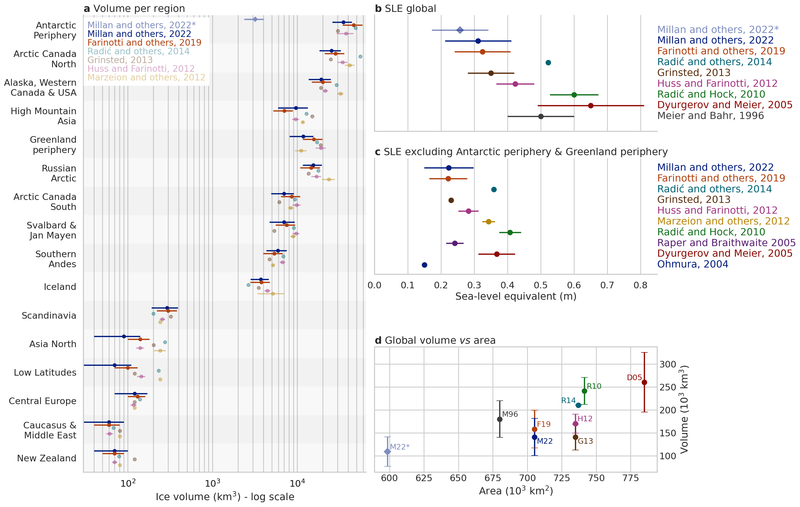
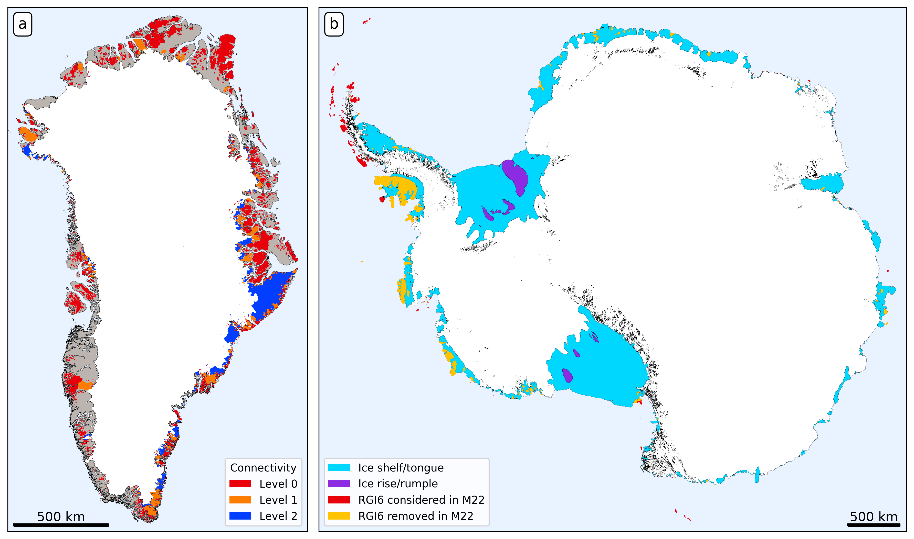

# Global glacier volume figures

A recent study by [Millan et al. (2022)](https://www.nature.com/articles/s41561-021-00885-z) provides new estimates of the volume of glaciers worldwide.

While the study is undoubtedly a tremendous improvement in methodology as well as fantastic new openly available dataset, their Table 1 and its interpretation makes two important errors related to the coverage of their velocity product and their choice to discard a large glaciated area of their analysis. This has important consequences for potential users of the data: we attempt to clarify these points in a paper submitted to the Journal of Glaciology (currently in review). 

This repository contains additional information and data products.

## Figures

Used in the paper:

## Corrected regional and global volumes

In the `data_regional_correction` folder, you will find to CSV files.

### Glacier per glacier volume 

`all_glaciers_m22_f19.csv` contains the individual glaciers' volume estimates as provided by the [Millan et al. (2022)](https://www.nature.com/articles/s41561-021-00885-z) (M22) and [Farinotti et al. (2019)](https://www.nature.com/articles/s41561-019-0300-3) studies. To compute the M22 estimates, reprojection and subsetting of the original M22 files was necessary - we did this with the OGGM framework [Maussion et al., 2019](https://gmd.copernicus.org/articles/12/909/2019/).

The M22 thickness data is available from [this website](https://www.sedoo.fr/theia-publication-products/?uuid=55acbdd5-3982-4eac-89b2-46703557938c), the F19 data from [this one](https://www.research-collection.ethz.ch/handle/20.500.11850/315707).

Details of the columns:
- `index`: RGI ID (RGI v6)
- `millan_vol_km3`: the volume of the glacier as computed from the original M22 dataset 
- `millan_area_km2`: the area covered by the dataset in this glacier as computed from the original M22 dataset 
- `millan_perc_cov`: the percentage of the glacier covered by the original M22 dataset 
- `f19_vol_km3`: the volume of the glacier as obtained from the original F19 dataset 
- `millan_vol_adj`: the volume of the glacier as computed from the original M22 dataset, but adjusted for regional undercatch (pixels non-attributable to a specific glacier). This is NOT a correction for the missing area, but necessary to match the regional volume estimates. The difference to  `millan_vol_km3` is small (< 5% in most cases)

### Corrected regional volumes

In `millan_table_corrected.csv`, we revise Table 1 in the paper on three aspects:
1. The values indicated in both the F19 and M22 publications are rounded for readability, which makes certain numbers in small regions too coarse for comparison and exact percentages. Here the numbers are directly extracted from the original data files of each respective study.
2. Region 19 (Antarctic and Subantarctic) is now considered as a whole, like in F19
3. The regional volumes are corrected for missing data coverage in the M22 product. For this correction, we use F19 to estimate the fraction of the volume missing in M22 and adjust accordingly (the underlying assumption is that F19 is a good estimate of the missing volume fraction, while the F19 total volumes are irrelevant).

See the code in [millan_regional_volume_scaling.ipynb](millan_regional_volume_scaling.ipynb) for more details.

Details of the columns:
- `millan_area_km2`: total area in the region covered by the M22 dataset
- `millan_vol_km3`: total volume of the region provided by the M22 dataset (without correction). These numbers should be identical to M22 Table 1 (they are not exact in some cases, but close enough - we assume rounding or small reporting errors in the paper).  **These numbers do not take missing area into account**.
- `f19_area_km2`: area covered by the F19 dataset. This is equivalent to the RGI area and the one that needs to be matched.
- `f19_vol_km3`: regional volume in the F19 dataset.
- `area_cov`: the area coverage in the M22 dataset, as computed by dividing `millan_area_km2` by `f19_area_km2`. These numbers should be close to (but not identical to) Table 1 in M22, because they report velocity coverage, not thichness. However, they are very close.
- `vol_diff`: the difference in volume as reported in Table 1 of M22, but computed by us. The numbers are close enough. **These numbers do not take missing area into account**.
- `cor_factor`: the correction to be applied to `millan_vol_km3` to account for missing area. 
- `millan_vol_km3_corrected`: the corrected regional volumes, **taking missing area ino account**. 
- `vol_diff_corrected`: the new difference in volume in percent. In almost all cases, this leads to a reduction of the reported differences. 

## Licence 

It's all coded in python 3. You'll need pandas, geopandas, matplotlib, and seaborn for this to work.

The code is released under BSD3. The regional volume data is **not** from us but from the respective studies. 

**If you use the data in the `data` folders, please refer to the original studies.**

**If you use these plots or the data in the `data_regional_correction` folder, please refer to** *Hock R., Maussion, R., Marzeion, B. and Nowicki, S., 2022: What is the global glacier ice volume outside the ice sheets?, Journal of Glaciology, submitted.*
